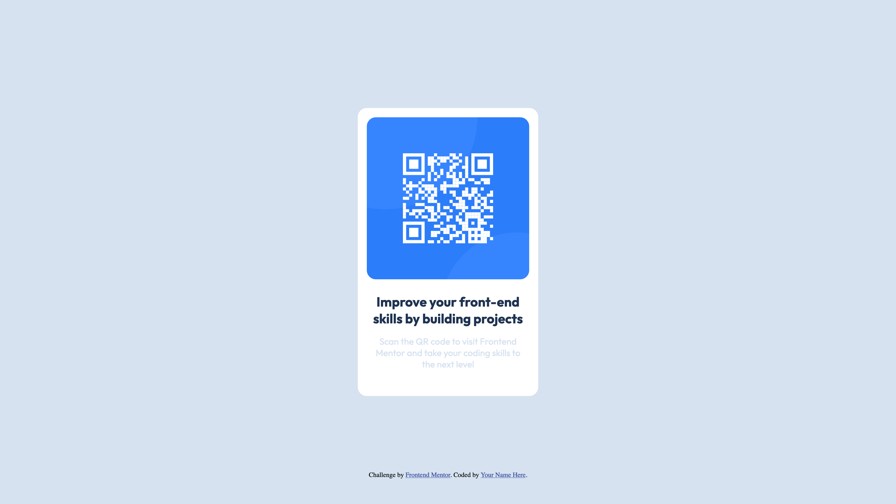
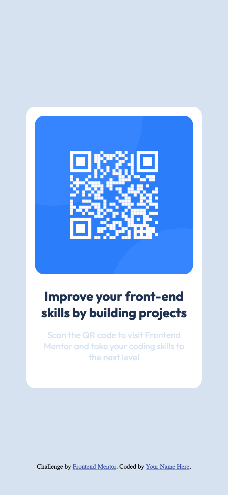

# Frontend Mentor - QR code component solution

This is a solution to the [QR code component challenge on Frontend Mentor](https://www.frontendmentor.io/challenges/qr-code-component-iux_sIO_H).

## Table of contents

- [Frontend Mentor - QR code component solution](#frontend-mentor---qr-code-component-solution)
  - [Table of contents](#table-of-contents)
  - [Overview](#overview)
    - [Screenshot](#screenshot)
    - [Links](#links)
  - [My process](#my-process)
    - [Built with](#built-with)
    - [What I learned](#what-i-learned)
    - [Continued development](#continued-development)
    - [Useful resources](#useful-resources)
  - [Author](#author)

## Overview

### Screenshot





### Links

- Solution URL: [Add solution URL here](https://your-solution-url.com)
- Live Site URL: [Add live site URL here](https://your-live-site-url.com)

## My process

### Built with

- Semantic HTML5 markup
- CSS custom properties
- Flexbox

### What I learned

Improved upon determining and arranging a layout of a web page.

```html
<div id="container">
    <div id="qr-container"></div>
    <div class="text-container">
        <h1>Improve your front-end skills by building projects</h1>
    </div>
    <div class="text-container">
        <p>Scan the QR code to visit Frontend Mentor and take your coding skills to the next level</p>
    </div>
</div>
```

Can't use align-items CSS property in the body without setting the body height to 100%.

```css
html,
body {
    height: 100%;
}

body {
    display: flex;
    justify-content: center;
    align-items: center;
    background-color: var(--clr-primary-300);
}
```

### Continued development

Need to keep improving on determining a layout.

### Useful resources

- [everythingfonts](https://everythingfonts.com/) - A really useful website for converting font extensions.
- [wakamaifondue](https://wakamaifondue.com/) - Another font-oriented website to help you set up custom fonts.

## Author

- Frontend Mentor - [@berealisss](https://www.frontendmentor.io/profile/berealisss)
- Github - [@berealisss](https://github.com/berealisss)
- Codepen - [@berealisss](https://codepen.io/berealisss)